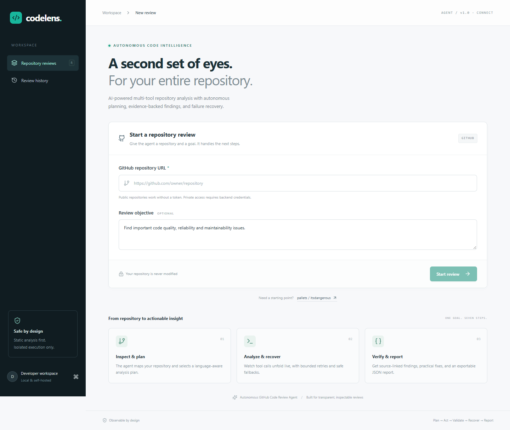
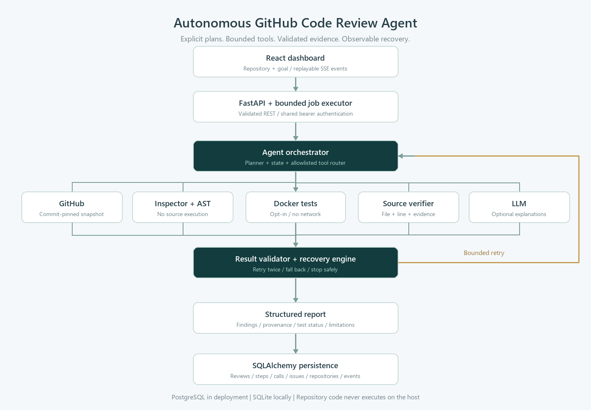

# Autonomous GitHub Code Review Agent

**An agentic system for repository analysis, evidence-backed code review and observable failure recovery.**



## Overview

Submit a GitHub repository URL and a natural-language review objective. The agent publishes a plan,
fetches a commit-pinned snapshot, inspects it, invokes analysis tools, validates results, recovers from
failures and exports a structured report. The React dashboard shows actions live and preserves history.

This implements the GitHub review example in the supplied **Agentic AI Engineer Intern Take-Home Assignment**.
The official PDF requires planning, two tools, deliberate failure handling, structured output, architecture,
sample transcripts and a one-page write-up. It does not prescribe a framework or a dataset.

## Problem

A single prompt cannot establish that a repository was fetched, a test was executed, or a finding has
real evidence. This project separates those observations from optional AI explanations and reports gaps
in coverage. A completed review can contain blocked tools or failing tests; completion is not a clean bill of health.

## Why This Is Agentic

There is explicit goal/state, a validated plan before acting, metadata-dependent strategy selection,
a tool router, sequential execution, observation validation, category-based retry/fallback, and a final
state-derived report. The planner is deliberately constrained and rules-based. It does not ask an LLM
to invent shell commands. The objective informs the plan description and optional AI explanations;
it does not dynamically create new analysis rules or arbitrary workflows.

## Architecture



[Mermaid diagram](docs/architecture.md) · [Complete tracked file structure](docs/file_structure.md)

React → FastAPI → bounded worker → planner/state → tools → validator/recovery → report → SQLAlchemy.
The same database stores replayable SSE events. PostgreSQL is the deployment target; SQLite makes
the local demonstration independent of an external database.

## Agent Loop

1. Accept and validate the repository URL and objective.
2. Publish a structured seven-step plan.
3. Acquire a bounded snapshot, recording its default branch and commit.
4. Inspect languages/frameworks/tests and adapt the plan strategy.
5. Route each step to a fixed tool, validate the result, retry or fall back when appropriate.
6. Verify findings against source; keep context-sensitive patterns marked as potential.
7. Compile issues, counts, observed tests, tool failures, recoveries and limitations into JSON.

Only actions and concise observations are exposed, never hidden chain-of-thought.

## Tools

| Tool | Actual behavior |
|---|---|
| GitHub repository | Public GitHub metadata and commit-pinned tarball; optional configured token for private access |
| Repository inspector | Files, languages, manifest-based frameworks/package manager and Python test detection |
| Static analyzer | Python AST: mutable defaults, bare handlers, empty broad handlers, eval, syntax failures; JS debugger candidates |
| Test runner | Fixed pytest command in restricted Docker, or explicit blocked/not-available status |
| Source inspection | Re-read bounded source and validate finding path, line and evidence |
| LLM analysis | Optional structured explanations for existing findings; never execution results |
| Report generator | Structured report from observed state, with provenance and limitations |

Every tool has a name, description, input/output schema and execute method. Tool results are validated
again by the executor. Ruff checks this application's code; this implementation does **not** claim to run
Ruff or ESLint on reviewed repositories. JS analysis is lexical, not a full semantic analysis.

## Failure Recovery

Timeouts, transient errors and invalid outputs receive at most two retries. Optional tool exhaustion
falls back to available evidence. Unsafe acquisition stops the job. Security failures never cause relaxed
policy. A failing test result is preserved without retrying it to manufacture a pass.

[Recovery policy](docs/failure_recovery.md) · [Normal run](docs/sample_run_1.md) ·
[Timeout recovery](docs/sample_run_2.md) · [Blocked unsafe operation](docs/sample_run_3.md)

## Security

No repository code runs on the host. No LLM-generated commands execute. Path/URL validation, bounded
archives, binary filtering, temporary snapshots, constrained tool schemas and optional Docker isolation
form the execution boundary. Docker is disabled by default and on standard hosting. A shared API token
is available for a private single-user deployment. [Read the full security model](docs/security.md).

## Tech Stack

Python 3.11+ (verified here with 3.12), FastAPI, Pydantic v2, SQLAlchemy 2, PostgreSQL/SQLite,
httpx, OpenAI structured outputs, React 19, TypeScript, Vite, Tailwind CSS, Lucide icons,
pytest, Vitest and Docker. LLM integration follows the
[official structured-output guide](https://developers.openai.com/api/docs/guides/structured-outputs).

## Project Structure

```text
backend/app/
  agent/       planner, state, router, executor, validator, recovery, orchestrator
  analyzers/   Python AST and JavaScript pattern analysis
  api/         validated REST routes and replayable SSE
  models/      shared strict Pydantic schemas
  tools/       typed tools and optional structured LLM adapter
  security/    path policy, redaction, command policy and Docker sandbox
  services/    database models/store and report generation
  prompts/     bounded reviewer instructions
backend/tests/ unit/integration/security tests and synthetic fixtures
frontend/src/  dashboard, timeline, reports, history, API/SSE client and tests
scripts/       CLI review, measured evaluation, demo seeding, browser smoke check
docs/          architecture, screenshots, write-up, transcripts and measured results
.github/       backend/frontend/container CI
```

## Local Setup

Requirements: Python 3.11+, Node 22 and pnpm 11.19.0. Git is needed only for managing this project;
repository acquisition uses the GitHub HTTP API. Docker is optional unless demonstrating actual test execution.

```sh
python -m venv .venv
# Windows PowerShell: .\.venv\Scripts\Activate.ps1
# macOS/Linux: source .venv/bin/activate
python -m pip install -r backend/requirements.lock
corepack enable
corepack prepare pnpm@11.19.0 --activate
cd frontend
pnpm install --frozen-lockfile
```

## Environment Variables

Copy `backend/.env.example` to `backend/.env` and `frontend/.env.example` to `frontend/.env`.
Run backend commands from `backend/` so that `.env` is loaded there. CLI scripts load `.env` from
their working directory. Alternatively set environment variables explicitly.

| Variable | Purpose / default |
|---|---|
| `DATABASE_URL` | SQLite locally; `postgresql+psycopg://...` for PostgreSQL |
| `CORS_ORIGINS` | Comma-separated exact frontend origins, localhost/127.0.0.1:5173 by default |
| `OPENAI_API_KEY` | Optional; unset means deterministic-only review |
| `LLM_MODEL` | Structured-output-capable model; default `gpt-4o-mini`, configurable |
| `GITHUB_TOKEN` | Optional private repository access; never sent to frontend |
| `API_TOKEN` | Shared bearer token; mandatory for an exposed deployment |
| `ENABLE_SANDBOX` | `false` by default; Docker tests require `true` and trusted image |
| `SANDBOX_IMAGE` | `review-sandbox:local` |
| `SIMULATE_FAILURE` | `true` injects failure into the selected tool |
| `SIMULATED_FAILURE_TOOL` | `test_runner` or `static_analysis` |
| `MAX_WORKERS` / `MAX_QUEUED` | 2 active / 10 waiting jobs |
| `VITE_API_URL` | Frontend's public backend URL, default `http://localhost:8000` |

`.env` files are ignored. Never put credentials in a `VITE_*` variable.

## Running Backend

```sh
cd backend
python -m uvicorn app.main:app --host 127.0.0.1 --port 8000
```

Health: `http://localhost:8000/api/health`. Interactive API docs: `http://localhost:8000/docs`.
Run **one worker process**: the queue is in-process. On restart, unfinished jobs are marked failed.

## Running Frontend

```sh
cd frontend
pnpm dev
```

Open `http://localhost:5173`. If API authentication is configured, click Developer workspace to enter
the token; it remains in memory (the top-right Connect button is available on mobile too). To load real, labeled synthetic demonstration reports, run from `backend/`:

```sh
python ../scripts/seed_demo.py
```

Then open Review history. Seeding is additive. Fixture URLs are labels, not actual GitHub repositories.

## Running Tests

```sh
cd backend
python -m pytest -q
python -m ruff check app tests
cd ../frontend
pnpm test
pnpm build
cd ..
python scripts/evaluate.py
```

Repository fixtures are excluded from host pytest collection. Tests use synthetic acquisition and mocked
LLM responses where appropriate. `scripts/ui_smoke.cjs` additionally exercises a running, seeded UI with
Playwright and installed Chrome. Install Playwright in a separate development environment or set
`PLAYWRIGHT_MODULE` to its installed module path.

Measured results and unverified integration boundaries are in [verification.md](docs/verification.md).
Evaluation output is [evaluation.json](docs/evaluation.json), not hardcoded performance claims.

## Running Failure Simulation

Set `SIMULATE_FAILURE=true` and `SIMULATED_FAILURE_TOOL=test_runner`, then restart the backend or run
the CLI. Use `static_analysis` for malformed-result simulation. Full shell examples are in
[failure_recovery.md](docs/failure_recovery.md). Unset the variables after the demonstration.

## Example Review

From the root, with the virtual environment active:

```sh
python scripts/review.py https://github.com/pallets/itsdangerous --output review.json
python scripts/review.py https://github.com/synthetic/python_bad --fixture python_bad
```

The first command uses live GitHub data. The second explicitly substitutes authored fixture acquisition.
Trace events go to stderr, final JSON to stdout. [Saved live report](docs/live_review.json).

## API Documentation

| Endpoint | Purpose |
|---|---|
| `POST /api/reviews` | `{repository_url, objective}` → HTTP 202 with job ID |
| `GET /api/reviews?limit=50&offset=0` | Paginated review history |
| `GET /api/reviews/{id}` | Job status, report when ready and stored events |
| `GET /api/reviews/{id}/report` | JSON report; HTTP 409 until ready |
| `GET /api/reviews/{id}/events?after=0` | SSE; replay events after ID, heartbeat, terminal `done` event |
| `GET /api/health` | Database connectivity check, `{"status":"healthy"}` |

Authenticated requests use `Authorization: Bearer <token>`. SSE uses fetch so the token never appears
in the URL. Input errors return 422, queue saturation 429, missing jobs 404. API errors never contain
provider credentials or raw request exception details.

## Deployment

See [deployment.md](docs/deployment.md) for Render, Vercel, Supabase/PostgreSQL, Compose, health validation,
Docker sandbox setup and exact GitHub publishing commands. Deployment files are prepared; no production
deployment or GitHub push is claimed without verification.

## Limitations

- One user/shared token; no per-user permissions, durable distributed queue, cancellation or migrations.
- Limited, conservative static rules. No general program proof, full type analysis, automatic patches or dependency audit.
- No automatic dependency install. Minimal Docker image contains pytest only; JS tests are not run.
- Rules-based plan; natural-language goals do not create arbitrary new tools or rules.
- Repository limits can reject large legitimate archives. Redaction recognizes common token formats only.
- Optional AI explanations need a provider key; private repository/LLM/Docker/PostgreSQL integrations need separate verification.
- Stored source excerpts may be sensitive. Apply database retention and access control before wider use.

## Future Improvements

Durable queue, isolated microVM workers, per-user identity, stronger language analyzers, precision/recall
benchmarks, cancellation, migrations, retention and dependency images approved outside the review workflow.

## Assessment Mapping

| Official assessment requirement | Implementation / evidence |
|---|---|
| High-level natural-language goal | UI/CLI objective and validated Goal schema |
| Visible plan before acting | Planner; `plan_created` emitted before first tool; dashboard timeline |
| At least two distinct tools | Seven named typed tools; acquisition, inspection and AST analysis work without LLM |
| Step-by-step execution | Explicit state, router and executor; persisted step and tool events |
| Deliberately induced failure | Test-runner timeout and malformed analyzer output switches |
| Self-correction / proper failure reporting | Two bounded retries, validated fallback, structured fatal report |
| Final structured output | JSON report, provenance, limitations, test status and execution metrics |
| No provided dataset | Public GitHub API at inference; authored fixtures clearly labeled |
| Source + working README | This monorepo, setup/run/test instructions |
| Architecture diagram | Mermaid and exported PNG |
| 2–3 sample transcripts | Three measured synthetic action transcripts with full reports |
| One-page write-up | `docs/writeup.md` |
| Engineering quality / initiative | pytest, Vitest, TypeScript/build, security boundaries, evaluation and CI |

See [the delivery checklist](docs/verification.md) for the additional requirements from the expanded brief.
