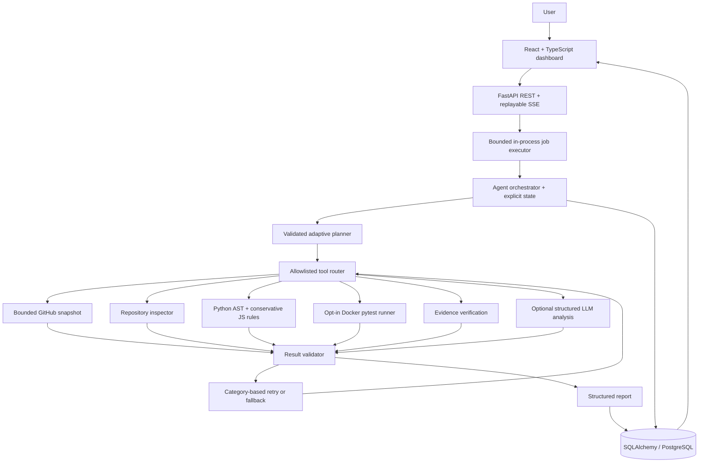

# Architecture

Events are public action summaries, never hidden reasoning. Database commits precede SSE delivery.
Each job owns a temporary snapshot. Plans adapt after repository inspection, using fixed tool names.
The LLM can explain observed evidence but cannot change tools, counts, commands or execution status.
Local SQLite is a zero-service convenience; deployment uses PostgreSQL. One API process owns the
bounded executor; interrupted reviews are marked failed on restart rather than silently resumed.
